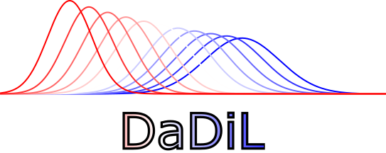
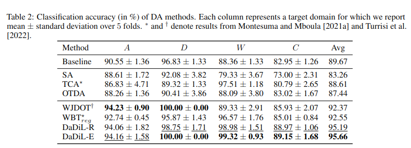
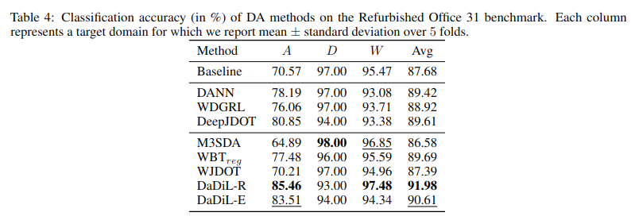
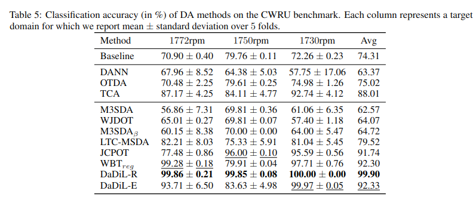

<p align="center">
  
</p>

# Dataset Dictionary Learning

This repository contains a demo of our algorithm, Dataset Dictionary Learning (DaDiL). This consists on the toy example used throughout the paper.

Our paper was accepted on the [26th European Conference on Artificial Intelligence](https://ecai2023.eu/) (ECAI 2023). You can check [our pre-print on ArXiv](https://arxiv.org/pdf/2307.14953.pdf)

## Abstract

This paper seeks to solve Multi-Source Domain Adaptation (MSDA), which aims to mitigate data distribution shifts when transferring knowledge from multiple labeled source domains to an unlabeled target domain. We propose a novel MSDA framework based on dictionary learning and optimal transport. We interpret each domain in MSDA as an empirical distribution. As such, we express each domain as a Wasserstein barycenter of dictionary atoms, which are empirical distributions. We propose a novel algorithm, DaDiL, for learning via mini-batches: (i) atom distributions; (ii) a matrix of barycentric coordinates. Based on our dictionary, we propose two novel methods for MSDA: DaDil-R, based on the reconstruction of labeled samples in the target domain, and DaDiL-E, based on the ensembling of classifiers learned on atom distributions. We evaluate our methods in 3 benchmarks: Caltech-Office, Refurbished Office 31, and CRWU, where we improved previous state-of-the-art by 3.15\%, 2.29\%, and 7.71\% in classification performance. Finally, we show that interpolations in the Wasserstein hull of learned atoms provide data that can generalize to the target domain

## Results

We experimented on 3 Multi-Source Domain Adaptation benchmarks: (i) Caltech-Office 10, (ii) Refurbished Office 31 and (iii) CWRU. The results are shown in the tables below,

### Caltech Office 10



### Refurbished Office 31



### CWRU



## Citation

```
@article{montesuma2023multi,
  title={Multi-Source Domain Adaptation through Dataset Dictionary Learning in Wasserstein Space},
  author={Montesuma, Eduardo Fernandes and Mboula, Fred Ngol{\`e} and Souloumiac, Antoine},
  journal={arXiv preprint arXiv:2307.14953},
  year={2023}
}
```